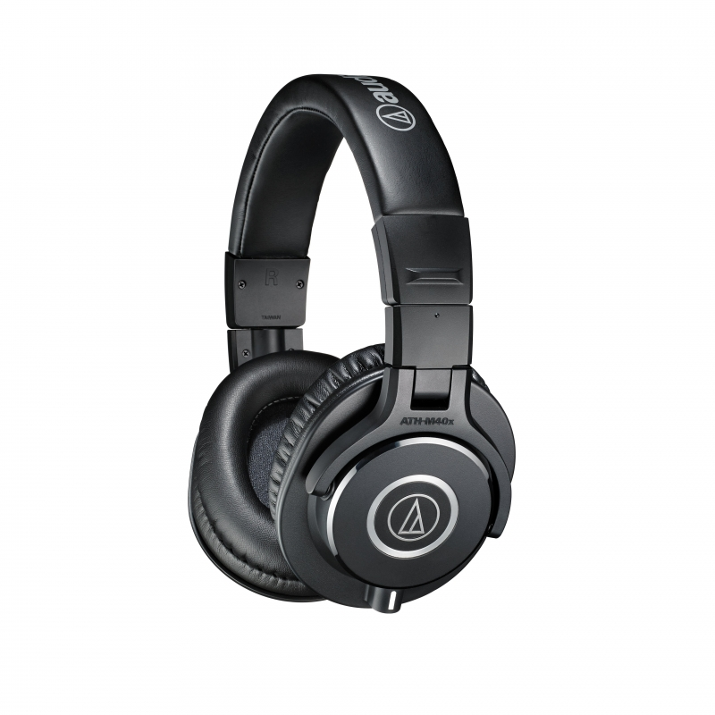
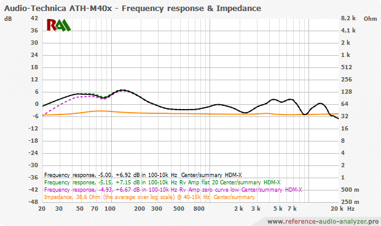

# [Audio Technica ATH-M40x](http://sea.audio-technica.com/products/headphones/professional/studio-monitoring/ath-m40x)

> The high-performance ATH-M40x professional headphones are tuned flat for incredibly accurate audio monitoring across an extended frequency range. Your studio experience is enhanced with superior sound isolation and swiveling earcups for convenient one-ear monitoring. Engineered with pro-grade materials and robust construction, the M40x excels in professional studio tracking and mixing, as well as DJ monitoring.

**Notice.** Sounds better then ATH-M50x. The ATH-M40x/M50x designed for music creators and DJs. However are good for music listening as well.

## Why is it awesome?
Best on-the-go stylish headphones. It is extremely neutral, with just a tiny bit of solidity to the bass which is actually kind of nice

> The ATH-M40x Professional Studio Monitor Headphones are well-rounded, affordable, and very highly-rated; a superior option for a range of tastes and opinions. Whether you are a long-time musical expert or an everyday music lover, this device could be a great addition to your life. [@Gerald](https://musicauthority.org/headphones/audio-technica-ath-m40x-review/)

## What is good?
- Portable
- Comfortable
- Balanced neutral/linear sound

## What is wrong?
- Ears touches ear-pads(presses on edges)

## Important specs
- Close principle
- Detachable cable
- Impedance: 35 ohms
- Weight: 240 g (8.5 oz), without cable and connector

## Recommendations
- If clamping force is to strong for you, you can stretch it - putting over something like PC case
- If ear-pads are hot for you, you will easily find different replacement on Amazon.

## Reviews
- [Z Review - Audio-Technica ATH-M40x (aka FU©K M50's even harder)](https://youtu.be/X6wBv03B1nk)
- [Are the ATH-M40x's good for just listening to music?](https://www.quora.com/Are-the-ATH-M40xs-good-for-just-listening-to-music)
- [Audio Technica ATH-M50x vs M40x vs Sennheiser HD 558 - Best Of The Best!](https://youtu.be/hocMcnJssE4)
- [Here's Why Audio-Technica's M40x is Better Than M50x](https://youtu.be/h8PzBc66x2w)
- [The M40X's are OFFICIAL M50X Killers](https://youtu.be/WiTkVVfq7Po)

## Alternatives
- TAKSTAR PRO 82 Professional Studio Dynamic Monitor Headphone
- Audio Technica ATH-M50X
- Sony MDR-7506
