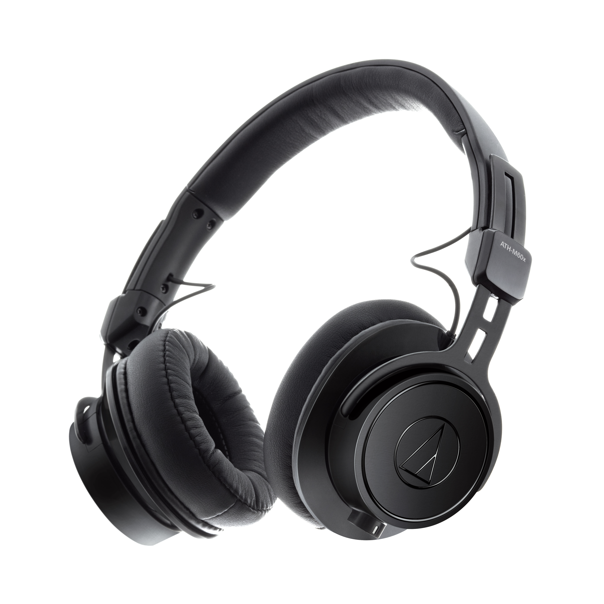

# [Audio-Technica ATH-M60x](https://eu.audio-technica.com/ATH-M60x)

> The low-profile, closed-back, on-ear design provides excellent sound isolation and a great fit, which is enhanced by the exceptional comfort and durability of the memory foam earpads and headband.

Excellent build quality and Audio Technica’s rock-solid reputation only sweeten the deal.  But once you put these babies on and give them a listen, there’s no going back; this really is an impressive headphone that sounds nothing short of miraculous. [@Audio46](https://audio46.com/audio-technica-ath-m60x-review/)

## Why is it awesome?
> Even if you had tons of money to spend, you still might not get a better sound with a different pair of cans. Instead, I would say, get the M60X and consider a good DAC or a high-res DAP for FLAC or WAV files. Then kick back and kiss the sky. [@Audio46](https://audio46.com/audio-technica-ath-m60x-review/)

## What is good?
- comfortable, light weight
- style
- appropriate sound for long listening sessions

## What is wrong?
- it's hard to find any bad points

## Important specs
- Closed-back dynamic
- Weight: 200 g (7.1 oz)
- Impedance: 38 ohms
- Detachable cable

## Recommendations
As others good headphones, they prefer hi-res source - FLAC files over MP3.

## Reviews
- [Z Review - Audio-Technica ATH-M60x [FFFFFFFFFFFFFFFFFFFFFFFFF]](https://youtu.be/N-bZSdd95h4)
- [Audio Technica ATH-M60X Review](https://audio46.com/audio-technica-ath-m60x-review/)

## Alternatives
- Bang & Olufsen Beoplay H6 | review by [Z Reviews](https://youtu.be/b_jqx1Ed-EE), by [metal571](https://youtu.be/0Vbgqvpm1nw)
- Bang & Olufsen Beoplay H4
