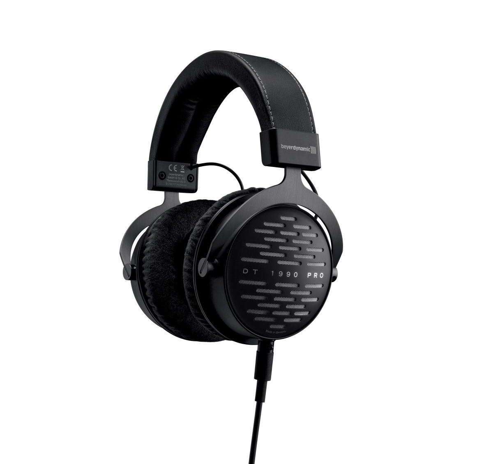

# [Beyerdynamic DT 1990 PRO](https://europe.beyerdynamic.com/dt-1990-pro.html)

> Open reference studio headphones for mixing and mastering

**Notice.** This is professional Hi-End headphones. Easy-home-music-listening is not the primary purpose of them.

## Why is it awesome?
- Mid range - awesome, low range - awesome, sound stage - awesome, build - awesome, treble - good. Comes with two kind  of pads.
- Definitely Hi-End in every aspect
- Sounds neutral, not boring sound, you will want to listen them again and again

## What is good?
- One of the best sound all around.
- With analytical pads sound a little bit more fun to listen

## What is wrong?
- Weight at 370 g makes them less comfortable when listening session longer then 3-4 hours strait. In this case HD 660 S is better(lighter and more comfortable construction).
- Only for vocal-specific music the HD 660 S is slightly better.

## Important specs
- Impedance: 250 ohms
- Weight: 370 g
- Detachable cable
- Analytical and Balance pads

## Recommendations
- Decent AMP is highly recommended
- Good source(sound card and FLAC files) is highly recommended

## Reviews
- [Beyer Amiron Home V.S. DT1990 Pro (Comparison)](https://youtu.be/Wm6RXYXJB0s)
- [Best $500 Headphones? HD-660S VS DT-1990](https://youtu.be/U05HdPL3s8U)
- [beyerdynamic DT 1990 PRO Review - A Sound Engineer's Friend](https://youtu.be/3L8gnhxrzto)
- [Beyerdynamic DT 1990 Pro Review](https://youtu.be/Uy3gfOm8kRE)
- [HD660 VS DT1990 | Sennheiser vs. Beyer](https://youtu.be/y805ZXKCaaM)
- [Z Review - Beyer-Dynamic DT1990 Like a German Porno...](https://youtu.be/-18wp68JHHs)

## Alternatives
- Beyerdynamic Amiron Home
