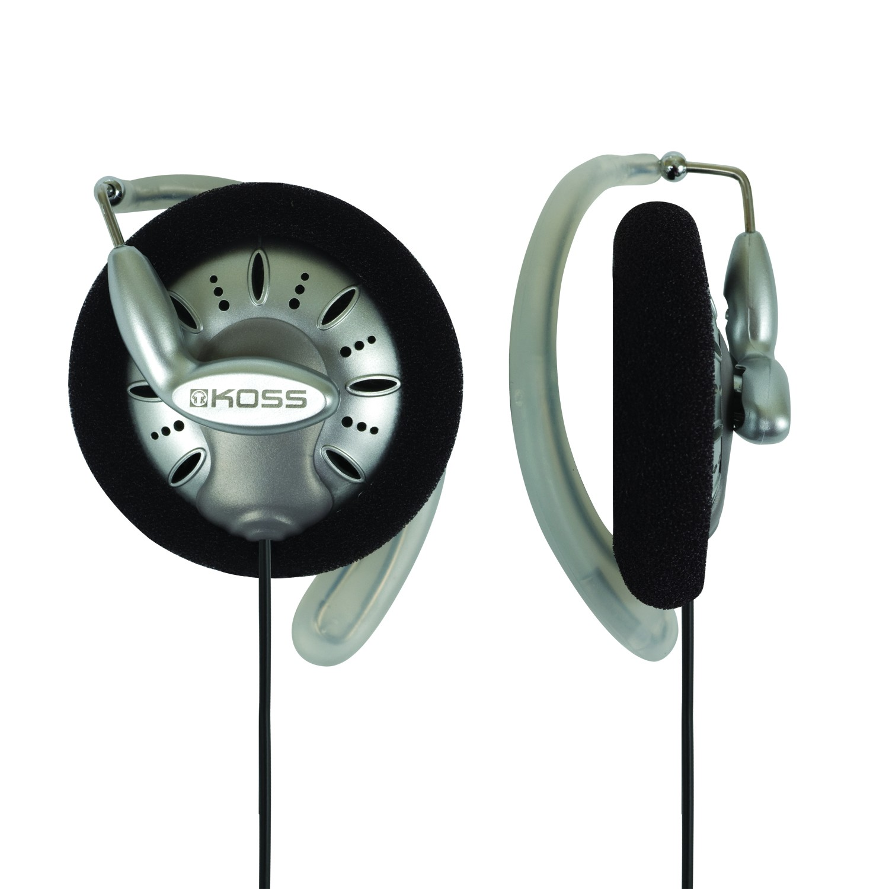

# [Koss KSC75](https://www.koss.com/headphones/ear-clip/ksc75)

> Clip the Koss KSC75 headphones comfortably over your ear and let yourself be amazed by the great sound of these high fidelity clip headphones

## Why is it awesome?
Comfort, sound, sound stage, etc. They are just damn so good! You can wear Koss KSC75 all day long and not event notice them.

## What is good?
- Sound like good $100 headphones
- Clip mechanism is very soft and comfortable
- Price

## What is wrong?
- None ;)

## Important specs
- Open principle

## Reviews
- [Z Review - Koss Everything (Pro/4AA + KSC75) aka The SpeedBall Episode](https://youtu.be/mx540xJ0ieY?t=1024)
- [Review: Koss KSC75 Portable On-Ear Headphones](https://youtu.be/13sjTRFS1ZM)

## Alternatives
- [Koss Porta Pro](../koss_porta_pro/README.md)
