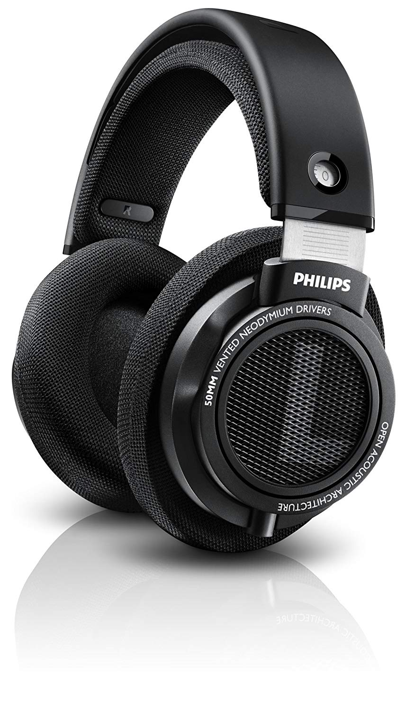

# [Philips HiFi Stereo Headphones](https://www.usa.philips.com/c-p/SHP9500S_27/hifi-stereo-headphones/overview)

Product title: **Philips SHP9500s**

> These headphones are "HD 600" with better sound stage and are more comfortable.
[@Z Reviews](https://youtu.be/aipXii-qWiQ)

## Why is it awesome?
They are one of the most comfortable headphones. And they sound really good, very close to the HD 600. Perfect for long listening sessions.

All reviewers compare Philips SHP9500s to Sennheiser HD 600, and they are very close to each other in terms of sound and comfort. But HD 600 costs three times more then SHP9500s. That's why Philips SHP9500s is amazing for its price.

## What is wrong?
- Pretty hot cans (summer time).
- Sit pretty loose on small head, clamping force is not strong enough. HD 600 holds better on small head.
- Siblings sound slightly irritatingly. Sounds a little bit bright(for some people).  But you probably would not find better alternative for this price.
- Hard to find on the market
-  Overpriced on Amazon. Can be found only on Aliexpress with recommended price tag
- Not the best choice for Hard Rock.

## Important specs
- Weight: 0.33  kg (0.728  lb)
- Impedance: 32  ohm
- Detachable cable

## Recommendation
Best suitable for medium/large head. For small head, look for other headphones. \
Good combination with [V Moda Gaming Mic Cable](https://v-moda.com/products/boompro-microphone).

## Reviews
- [Philips SHP9500 Review (you know where this is going)](https://youtu.be/2aKvrkVwB9Q)
- [Philips SHP9500s Review and Comparison VS HD600](https://youtu.be/zbwKp3f38R0)
- [Z Review - Philips SHP9500 (AKA F'n Amazeballs)](https://youtu.be/aipXii-qWiQ)
- [Philips SHP9500 Review - The HD 600 Replacement?](https://youtu.be/Lv7eoP4gAPg)

## Next Level?
- Sennheiser HD 600
