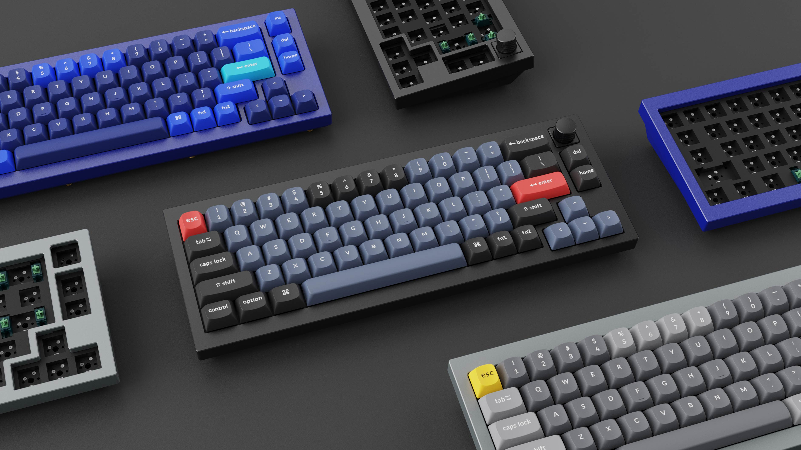

# [Keychron Q2](https://www.keychron.com/products/keychron-q2-qmk-custom-mechanical-keyboard)

## What is good?

- layout with nice gap separation of arrow keys
- volume knob
- double-gasket design
- Hot-swappable switches

## Reviews

- [Keychron Q2 Keyboard Review After 2 Months!](https://youtu.be/wzQnhWOBnkU)
