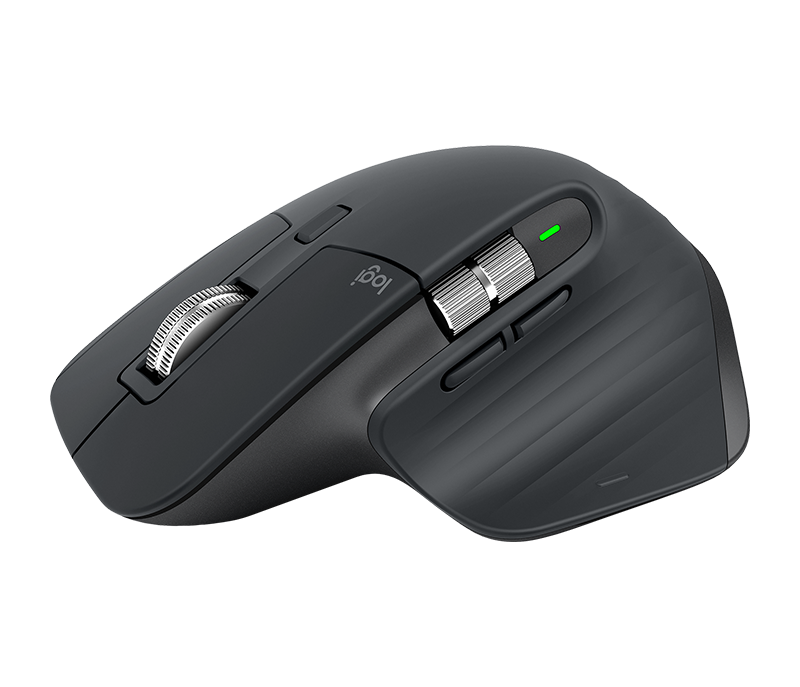

# [Logitech MX Master 3](https://www.logitech.com/en-in/product/mx-master-3.html)

>  It’s the most advanced Master Series mouse yet – designed for creatives and engineered for coders.

Simply the most customizable mouse with relaxing ergonomic shape, premium materials, and feel. Wireless.

**NOTICE:** If you already suffer from carpal tunnel syndrome it will be safer to use a mouse with more expressive vertical posture, - i.e. [Microsoft Sculpt Ergonomic Mouse](../sculpt_ergonomic_mouse). After healing, - *MX 3 Master* is a safe choice.

## Why is it awesome?

Apart from Infinite-scroll wheel and being comfortable, it has endless configurations on per-app basis.

## What is good?

- Shape
- MagSpeed Electromagnetic scrolling (aka Hyper/Infinite scroll)
- Can work without dongle
- Horizontal scroll

## What is wrong?

- Heavy and tall, not fit for small hand size
- In some programs (i.e Electron-based, like VSCode) horizontal scroll may not work
- No Linux support (Sensor, wheel, and buttons will be supported without adding additional drivers in most popular Linux distributions.)

## Important specs

- Dimensions: 84.3 x 124.9 x 51 mm
- Weight: 141 g

## Recommendations

Do not buy it for Linux use. Only for the right hand. Consider **Logitech G903** as a gaming alternative.

## Reviews

- [Logitech MX Master 3 vs Razer Pro Click Mouse](https://youtu.be/OXZjt_SHBxc)
- [MX Master 3 Unboxing & Comparison Review](https://youtu.be/g0DF18FIboE)
- [MX Master for Mac review - do you NEED a PRO mouse?](https://youtu.be/HpyFLDk1E_s)
- [Logitech MX Master 3 Review - I'm Switching!](https://youtu.be/ayeY6zbS0NI)

## Alternatives

- [Logitech G903 LIGHTSPEED Wireless Gaming Mouse](https://www.logitechg.com/en-us/products/gaming-mice/g903-hero-wireless-gaming-mouse.html)
- [Logitech MX ANYWHERE 3](https://www.logitech.com/en-in/products/mice/mx-anywhere-3.html)
- [Logitech M720 TRIATHLON](https://www.logitech.com/en-in/products/mice/m720-triathlon.html)
