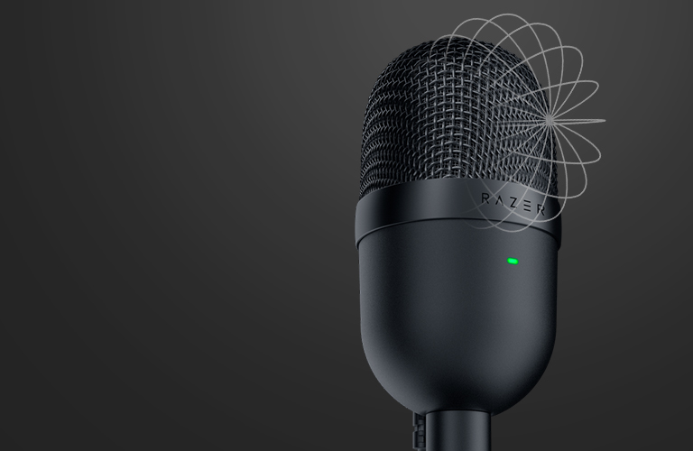

# [Razer Seiren Mini](https://www.razer.com/streaming-microphones/razer-seiren-mini/RZ19-03450100-R3U1)

Professional Recording Quality Microphone

> Because this compact condenser mic is tuned with a tighter pickup angle, it can focus on your voice and has better ambient noise reduction — ensuring that background sounds like typing and mouse clicks are minimized.

## What is good?

- Sound Quality

## Important specs

- Connectivity: USB

## Reviews

- [Top 5 Gaming / Streaming Microphones of 2020!](https://youtu.be/6CU347TSE54)
